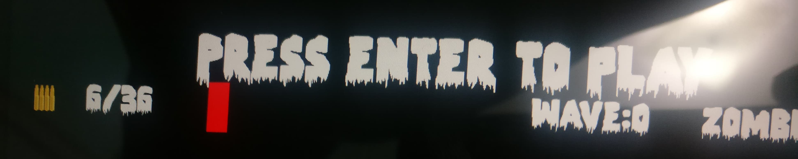
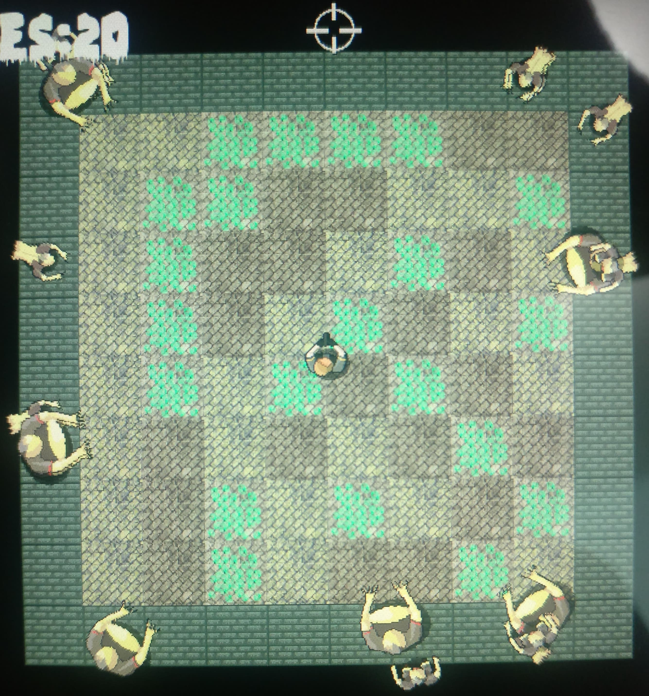

# Zombie Shooter
This is a game I programmed in C++ in my free time, solidifying a variety of Object Oriented Programming fundamental concepts and implementing them into a real application. 

## Game HUD

## Technical Details

### Classes
These concepts ranged from a wide diversity, including **classes to represent game components**, such as a class for the player, as well as many more classes for different components such as zombies and accessories.
**Singleton classes** were also incorporated to represent certain objects of which only one instance could exist, as well as **static class** implementation as well.

### Pointer Implementation
**Pointers** were implemented for memory maintenance and **dynamic memory allocation**. Memory was allocated when necessary for use and deleted when no longer necessary, ensuring optimal use of memory.

## Libraries
The **SFML Library** was used for the game's development and its manny classes as well as class methods were used in the development process for a variety of areas, such as **graphics**, **audio**, and many more areas.
